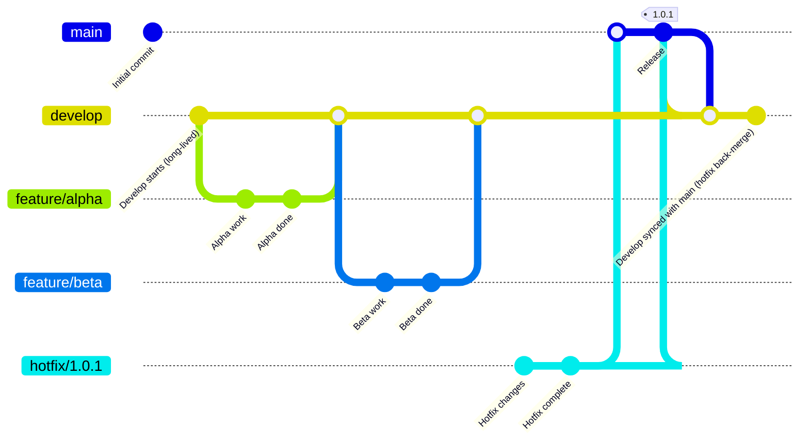
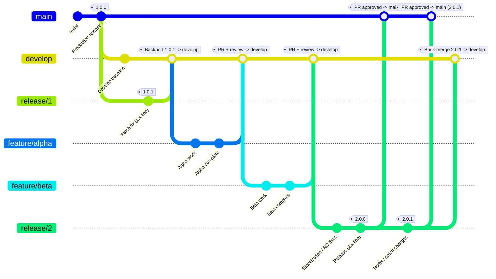

### Gitflow Development

1. **Start on `main` with a clean baseline**
    - Create the initial commit.
    - Create the first production release on `main` and tag it **`1.0.0`**.

2. **Create a long-lived `develop` branch**
    - Branch `develop` off `main`.
    - Continue day-to-day integration work on `develop` (it can contain changes not yet in production).

3. **Build features in isolated branches (from `develop`)**
    - Create `feature/alpha` from `develop`.
    - Do the alpha work, then **merge `feature/alpha` back into `develop`** (typically via PR + code review).
    - Repeat the same pattern for `feature/beta`: branch from `develop`, do work, then merge back into `develop`.

4. **A production issue appears: create a hotfix from `main`**
    - Switch back to `main` (because production fixes must start from what is actually deployed).
    - Create `hotfix/1.0.1` from `main`.
    - Make the hotfix commits on that branch.

5. **Promote the hotfix to production**
    - Merge `hotfix/1.0.1` back into `main` (typically via PR).
    - Tag the new production state on `main` as **`1.0.1`**.

6. **Back-merge production changes to `develop`**
    - Merge `main` into `develop` so `develop` includes the hotfix changes.
    - This prevents the hotfix from being “lost” and ensures future releases from `develop` include it.

---

---

### Gitflow Infrastructure (IaC with long lived branches)

#### Branch roles
- **`main`**: Always production-ready. Protected. Updated only via PR.
- **`develop`**: Long-lived integration branch. Contains changes not yet in production.
- **`release/1`, `release/2`, ...**: Long-lived release lines. Used for rollback and for patching a specific release line over time.
- **`feature/*`**: Short-lived branches created from `develop` for individual changes (charts, values, policies, etc.).

---

### Step-by-step process

### 1) Establish the first production release on `main`
1. Commit the initial baseline to `main`.
2. Cut the first production release on `main`.
3. Tag the production commit (example: `1.0.0`).

#### 2) Create long-lived branches
4. Create **`develop`** from `main` for ongoing integration work.
5. Create **`release/1`** from `main` at the `1.0.0` point. This becomes the long-lived branch for the **1.x** release line.

#### 3) Patch an older release line (example: `release/1`)
6. Apply patch changes directly on `release/1` (via PR).
7. Tag the patched state (example: `1.0.1`).
8. Backport the patch into `develop` by merging `release/1` → `develop` (via PR), so future releases do not lose the fix.

#### 4) Build features from `develop`
9. Create `feature/alpha` from `develop`, implement changes, then PR merge back into `develop`.
10. Create `feature/beta` from `develop`, implement changes, then PR merge back into `develop`.

#### 5) Cut a new long-lived release line (example: `release/2`)
11. When ready to prepare the next major/minor release, create **`release/2`** from `develop`.
12. Do stabilization/RC-only changes on `release/2`.
13. Tag the release on `release/2` (example: `2.0.0`).

#### 6) Promote the release line to production
14. PR merge `release/2` → `main`. `main` now reflects the production state for `2.0.0`.

#### 7) Patch the current production release line (example: `release/2`)
15. Apply patch changes on `release/2` (via PR).
16. Tag the patched state (example: `2.0.1`).
17. PR merge `release/2` → `main` to promote the patch to production.
18. Merge `release/2` → `develop` to keep `develop` aligned with what shipped.

---

### Rollback approach (using long-lived release branches)
- To roll back production from `main`, redeploy using the **tag** on the appropriate long-lived release branch:
   - Roll back to `2.0.0` by deploying tag `2.0.0` from `release/2`.
   - Roll back to `1.0.1` by deploying tag `1.0.1` from `release/1`.

> Even with long-lived release branches, tagging each release/patch is critical for repeatable, deterministic rollbacks.
