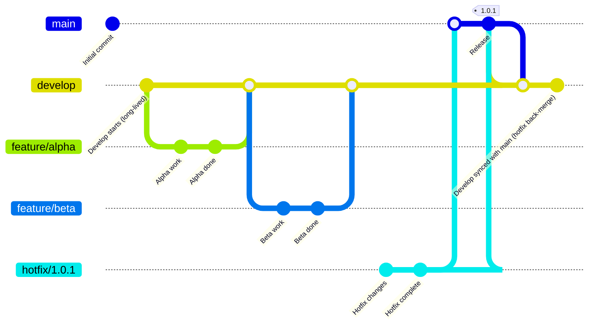
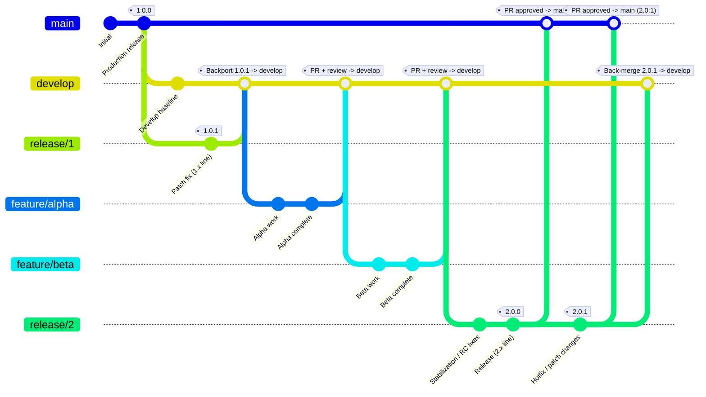

### Gitflow Development

1. **Start on `main` with a clean baseline**
    - Create the initial commit.
    - Create the first production release on `main` and tag it **`1.0.0`**.

2. **Create a long-lived `develop` branch**
    - Branch `develop` off `main`.
    - Continue day-to-day integration work on `develop` (it can contain changes not yet in production).

3. **Build features in isolated branches (from `develop`)**
    - Create `feature/alpha` from `develop`.
    - Do the alpha work, then **merge `feature/alpha` back into `develop`** (typically via PR + code review).
    - Repeat the same pattern for `feature/beta`: branch from `develop`, do work, then merge back into `develop`.

4. **A production issue appears: create a hotfix from `main`**
    - Switch back to `main` (because production fixes must start from what is actually deployed).
    - Create `hotfix/1.0.1` from `main`.
    - Make the hotfix commits on that branch.

5. **Promote the hotfix to production**
    - Merge `hotfix/1.0.1` back into `main` (typically via PR).
    - Tag the new production state on `main` as **`1.0.1`**.

6. **Back-merge production changes to `develop`**
    - Merge `main` into `develop` so `develop` includes the hotfix changes.
    - This prevents the hotfix from being “lost” and ensures future releases from `develop` include it.

---

---

### Gitflow Infrastructure (IaC with long lived branches)

## IaC Git process (Helm/Kubernetes) with long-lived release branches

### Branch roles
- **`main`**: Always production-ready; protected; updated only via PR.
- **`develop`**: Long-lived integration branch; contains changes not yet in production.
- **`release/1`, `release/2`, ...**: Long-lived release lines; used to preserve historical release states and apply patches to a specific line.
- **`feature/*`**: Short-lived branches for individual changes; branched from `develop`.

---

### Process steps

1. **Create the initial production baseline**
   - Commit the initial IaC/Helm baseline to `main`.
   - Tag the first production release on `main` (e.g., `1.0.0`).

2. **Create long-lived integration and release branches**
   - Create `develop` from `main` for ongoing work.
   - Create `release/1` from `main` at the `1.0.0` point to represent the long-lived **1.x** release line.

3. **Implement features (day-to-day change flow)**
   - Create `feature/<name>` from `develop`.
   - Make changes (Helm charts, values, policies, pipelines).
   - Open a PR and merge `feature/<name>` → `develop` after review and checks.

4. **Cut a new release line when ready**
   - Create `release/2` from `develop` when preparing the next major/minor release.
   - Perform only release-hardening changes on `release/2` (stabilization/RC fixes).
   - Tag the release on `release/2` (e.g., `2.0.0`).

5. **Promote a release to production**
   - Open a PR and merge `release/2` → `main`.
   - `main` now reflects the production state for that release (e.g., `2.0.0`).

6. **Patch an existing release line (hotfix/patches)**
   - Apply patch changes on the relevant long-lived branch (e.g., `release/2` for a `2.x` patch, or `release/1` for a `1.x` patch).
   - Tag the patched state (e.g., `2.0.1`).

7. **Promote patch to production**
   - Open a PR and merge the patched release branch → `main` (e.g., `release/2` → `main`).
   - `main` is now production-ready at the patched version (e.g., `2.0.1`).

8. **Keep `develop` aligned with what shipped**
   - Merge the relevant release branch back into `develop` (e.g., `release/2` → `develop`) so future releases include the patch.

9. **Rollback using long-lived release branches**
   - Roll back by deploying the previously tagged state from the relevant release line:
      - Example: roll back to `2.0.0` by deploying tag `2.0.

> Even with long-lived release branches, tagging each release/patch is critical for repeatable, deterministic rollbacks.

### Environment handling (important for IaC)

Avoid putting **environment** differences in branches. Use environment-specific configuration files such as:

- `environments/dev/values.yaml`
- `environments/stage/values.yaml`
- `environments/prod/values.yaml`

Alternatively, use **Helmfile** or **Kustomize overlays** per environment. This prevents “prod branch vs dev branch” drift.

---

### CI/CD guardrails to add (high value for Helm repos)

- `helm lint`
- `helm template` + Kubernetes schema validation
- **Policy as code**: OPA/Conftest (e.g., prevent `latest` tag, require resource limits, restrict privileged containers)
- Diff preview on PR (Argo CD diff / Flux diff / `helm diff`)
- Require approvals for changes under `environments/prod/*`
