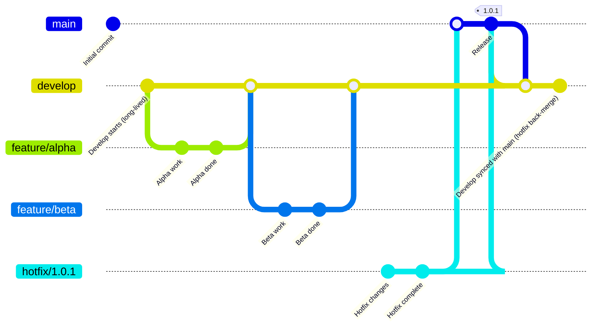

### Gitflow Development

1. **Start on `main` with a clean baseline**
    - Create the initial commit.
    - Create the first production release on `main` and tag it **`1.0.0`**.

2. **Create a long-lived `develop` branch**
    - Branch `develop` off `main`.
    - Continue day-to-day integration work on `develop` (it can contain changes not yet in production).

3. **Build features in isolated branches (from `develop`)**
    - Create `feature/alpha` from `develop`.
    - Do the alpha work, then **merge `feature/alpha` back into `develop`** (typically via PR + code review).
    - Repeat the same pattern for `feature/beta`: branch from `develop`, do work, then merge back into `develop`.

4. **A production issue appears: create a hotfix from `main`**
    - Switch back to `main` (because production fixes must start from what is actually deployed).
    - Create `hotfix/1.0.1` from `main`.
    - Make the hotfix commits on that branch.

5. **Promote the hotfix to production**
    - Merge `hotfix/1.0.1` back into `main` (typically via PR).
    - Tag the new production state on `main` as **`1.0.1`**.

6. **Back-merge production changes to `develop`**
    - Merge `main` into `develop` so `develop` includes the hotfix changes.
    - This prevents the hotfix from being “lost” and ensures future releases from `develop` include it.


### Gitflow Infrastructure
```mermaid

```